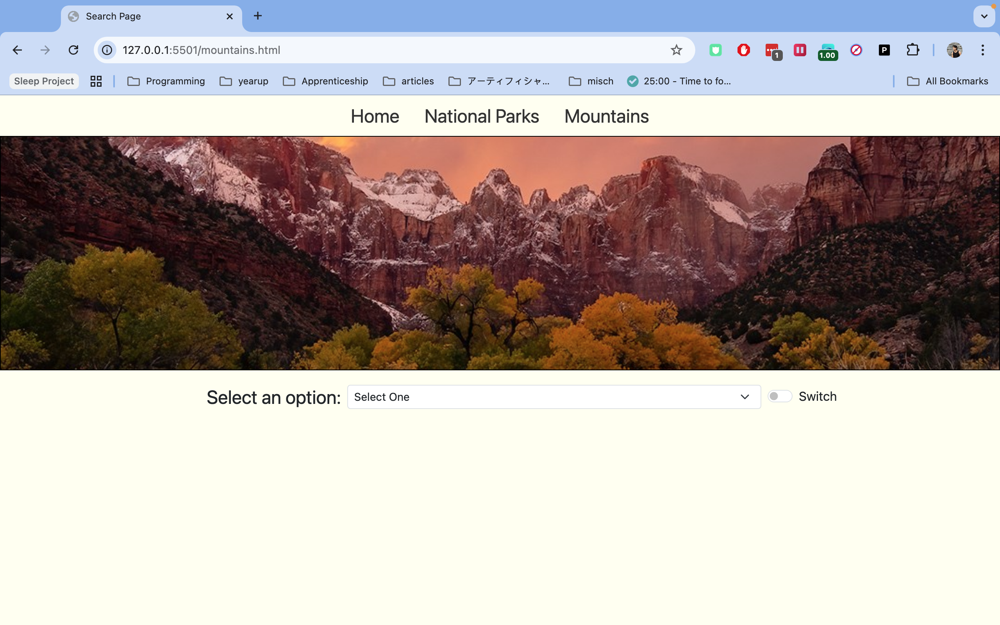
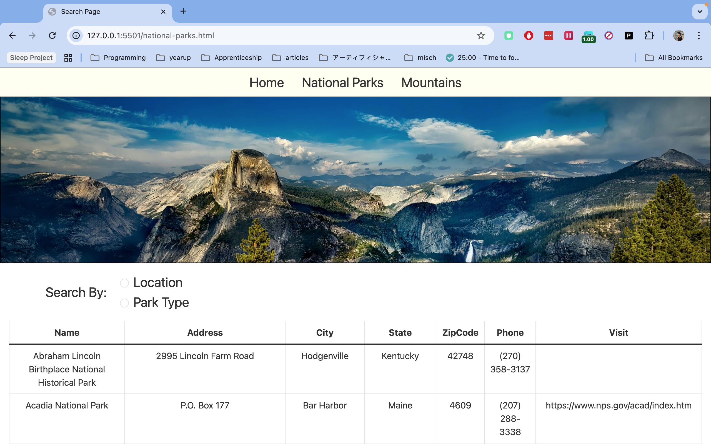
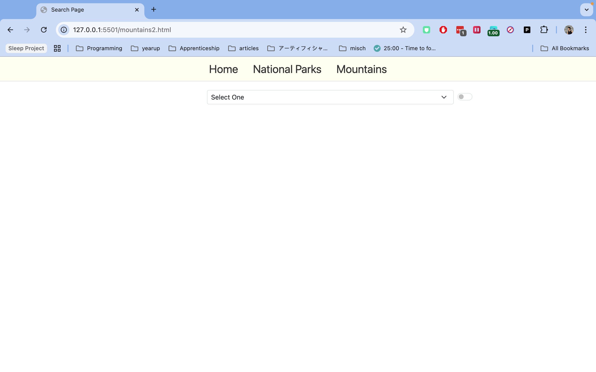

# **National Parks & Mountains Web Application**

This web application provides information on national parks and mountains, allowing users to search and filter data on each page. The application is developed using HTML, CSS, JavaScript, and Bootstrap.

## **Table of Contents**
- [Features](#features)
- [Project Structure](#project-structure)
- [Getting Started](#getting-started)
- [Usage](#usage)
- [Functions](#functions)
- [Resources](#resources)

## **Features**
- **Mountain Page**: Allows users to select a mountain from a dropdown menu, displaying its image, elevation, effort level, and description.
- **National Parks Page**: Enables users to search national parks based on location or type, displaying relevant park details in a table format.
- **Search Page**: An additional mountain page view with API-based image search functionality, dynamically displaying mountain information including elevation, effort, and a description.

## **Project Structure**
- `index.html`: The home page.
- `national-parks.html`: Page with a table listing parks based on the selected location or park type.
- `mountains.html`: Page featuring mountain details when selected from a dropdown.
- `search.html`: A second mountain page that provides similar dropdown functionality but uses an API to dynamically fetch mountain images.
- `styles/styles.css`: Custom CSS styling for the application.
- `styles/mountains2.css`: Additional styling specific to the search page.
- `scripts/`: Contains JavaScript files for data handling and functionality:
  - `locationData.js`: Contains location information for the national parks.
  - `parkTypeData.js`: Contains types of parks.
  - `nationalParkData.js`: Contains data about each national park.
  - `mountainData.js`: Contains data on each mountain.
  - `mountains.js`: JavaScript for handling mountain dropdown and park filters on the main mountain page.
  - `mountains2.js`: JavaScript for handling the additional search page functionality, including API-based image search.

## **Getting Started**
1. Clone this repository to your local machine.
2. Open `index.html` in your browser to start the application.
3. Ensure the `scripts/` folder and `styles/` folder are in the correct structure for the app to function properly.

## **Usage**
### **Mountain Page:**
1. Select a mountain from the dropdown menu.
2. Information, including image, elevation, and description, displays once a mountain is selected.

### **National Parks Page:**
1. Choose a filter option: location or park type.
2. Select an option from the dropdown to filter parks, and the table updates automatically.

### **Search Page:**
1. Select a mountain from the dropdown.
2. The page dynamically retrieves an image of the selected mountain using an API.
3. Toggle the switch input to navigate back to the main mountain page (`mountains.html`).

## **Functions**
### **Mountain Page**
- **populateMountainDropdown**: Populates the mountain dropdown with mountain names from `mountainData.js`.
- **displayMountainDropdown**: Displays selected mountain details, including the name, image, elevation, and description.
- **fetchMountainImage**: Retrieves the image and attributes of the selected mountain.
- **setMountainImage, setMountainAttributes, setMountainDescription**: Display respective details of the selected mountain.
- **revealDisplay**: Reveals hidden elements when displaying mountain details.

### **National Parks Page**
- **loadTableData**: Loads park data into a table based on location or type.
- **initializeDropdown**: Sets up event listeners for radio buttons to determine filter type (location/type).
- **populateDropdown, resetDropdown, displayDropdown**: Manages display of dropdown based on selected radio button.
- **captureInput**: Captures user selection and filters table data.
- **parseArray**: Filters and loads table data based on the selected criteria.
- **createTableRow, clearTable**: Functions for managing rows in the table.

### **Search Page**
- **mountains_PopulateDropDown**: Populates the dropdown on the search page with mountain names.
- **mountainsDisplayDropDown**: Displays mountain details when a selection is made.
- **searchMountainImage**: Uses an API to retrieve an image based on the selected mountain name.
- **addMountainImage, addMountainattr, addDescription**: Update and display mountain image, attributes, and description on the page.
- **changeDisplay**: Reveals hidden elements for displaying the mountain’s details.
- **switchInput**: Toggles the navigation to `mountains.html` if the switch is selected.

## **Resources**
- **Bootstrap**: Used for styling and responsive design.
- **JavaScript**: For DOM manipulation, event handling, and data processing.
- **Google Custom Search API**: Used in `search.html` to fetch images based on the selected mountain name.
